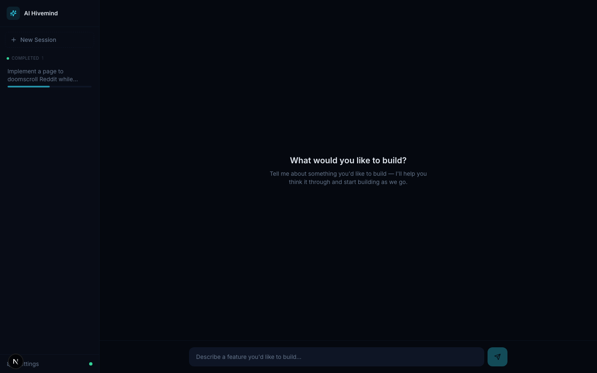
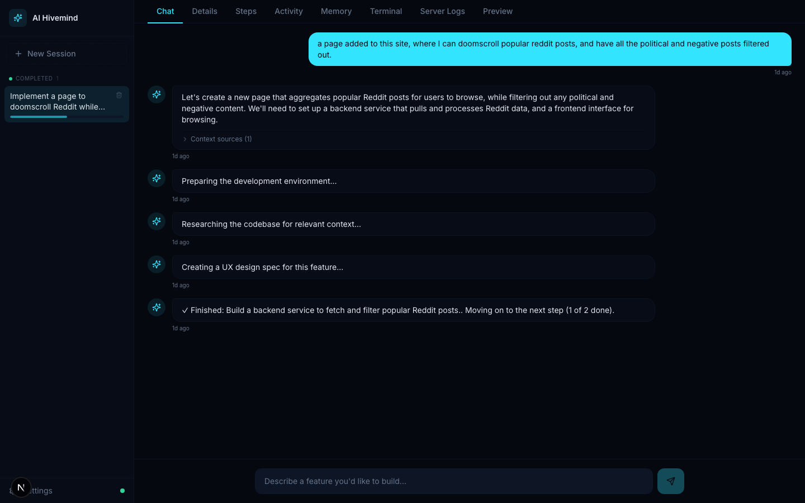
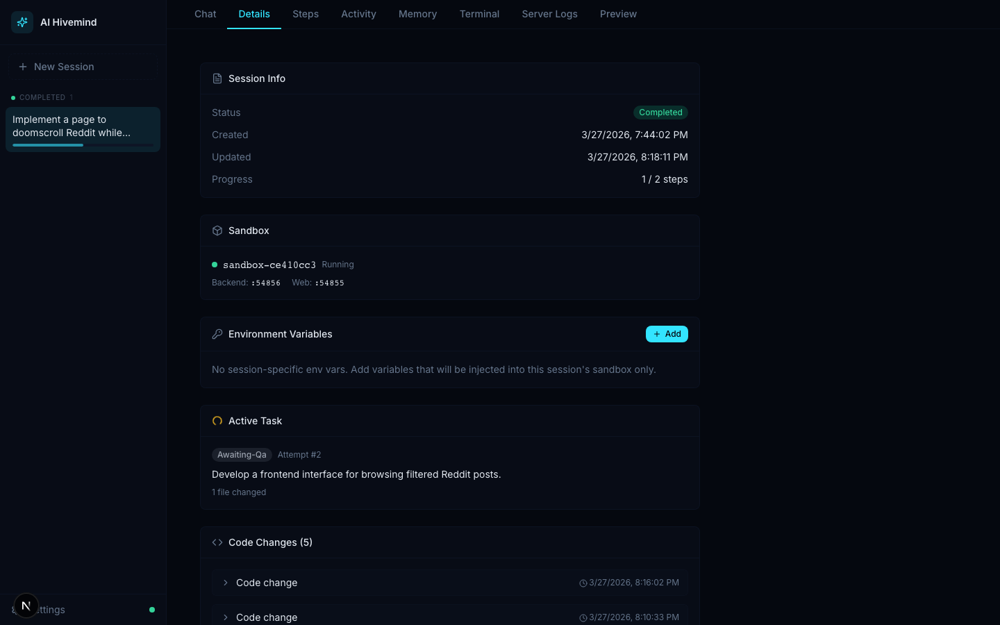
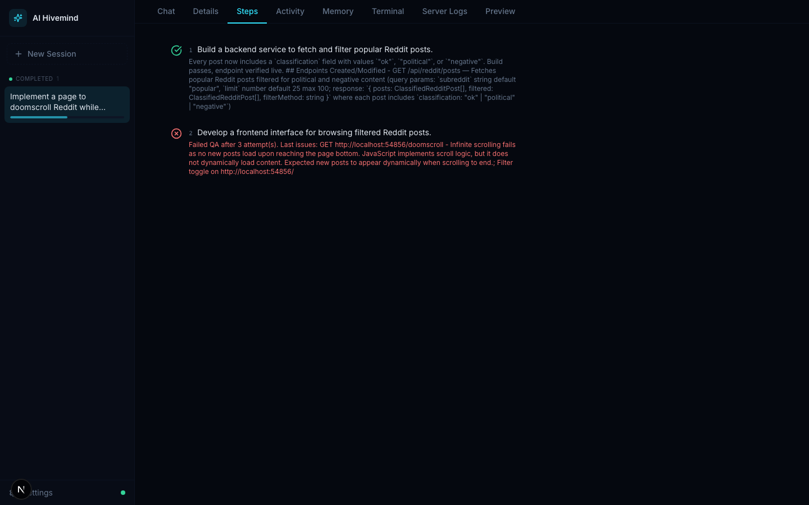
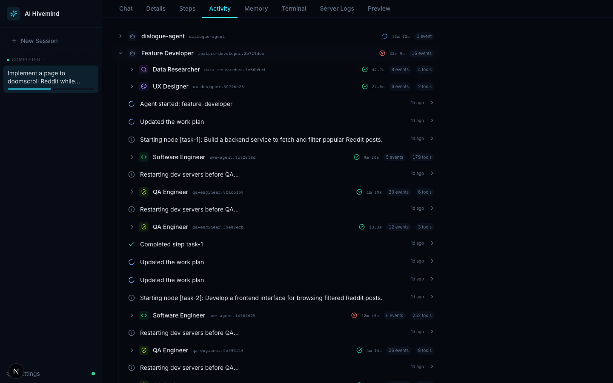
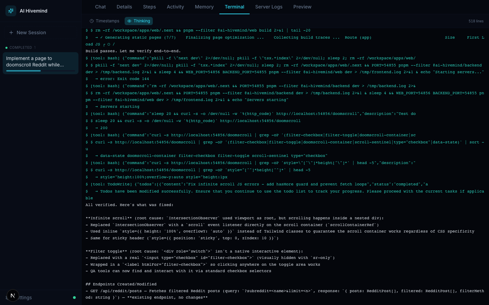
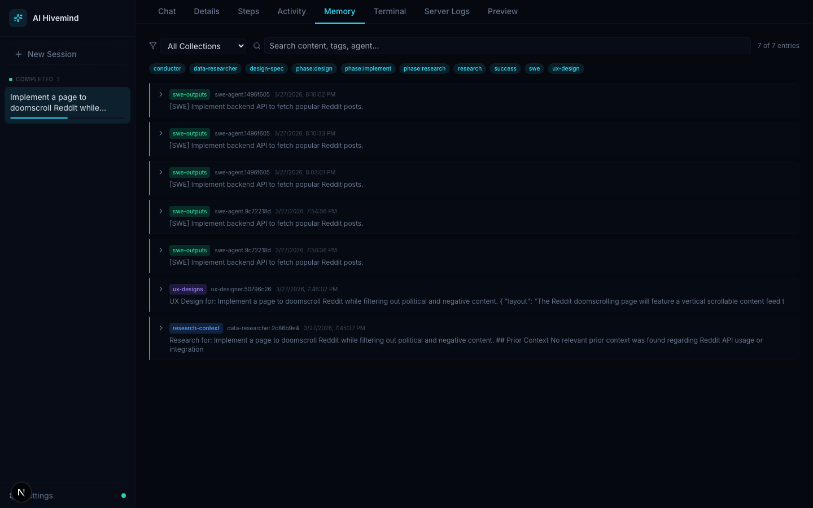

# AI Hivemind

**Autonomous Software Engineering Platform**

A chat-driven command center where you describe a feature in natural language and a swarm of AI agents collaboratively researches, plans, implements, and QA-tests it inside an isolated Docker sandbox — then merges the result back into your monorepo.

---

## How It Works

```
User message
  → DialogueAgent (conversational planning, task graph creation)
    → DataResearcher / SiteExplorer / UxDesigner (information gathering)
    → TaskGraph created (DAG of subtasks with dependencies)
    → FeatureDeveloper (executes graph nodes sequentially)
      → For each node:
         Conductor spawns Claude Code CLI inside Docker sandbox
         → QaEngineer validates (spawns TestExecutor agents)
         → QaArbiter decides: retry / accept / ask user
  → Checkout merges sandbox files into monorepo → FEATURE_DEPLOYED
```

All agent communication flows through the **Nerve Center Event Bus**. Every event is written to an append-only SQLite ledger before being published — enabling full replay, crash recovery, and real-time observability.

---

## Screenshots

### Command Center — New Session

Describe what you want to build in natural language. The sidebar shows all sessions grouped by status.



### Chat — Conversational Planning

The DialogueAgent breaks down your request, gathers context, and builds a task graph through conversation.



### Details — Session Overview

Session metadata, sandbox status, environment variables, active tasks, and code changes at a glance.



### Steps — Task Graph

Hierarchical view of the task DAG with objectives, acceptance criteria, and completion status per node.



### Activity — Agent Timeline

Full agent tree showing every spawned agent (DialogueAgent, FeatureDeveloper, SWE, QA, UxDesigner) with their event timelines.



### Terminal — Conductor Stream

Raw Claude Code CLI output — see exactly what the AI agents are doing in real time.



### Memory — RAG Store

Agent working memory organized by collection. Searchable research findings, SWE artifacts, and design specs.



---

## Monorepo Structure

```
ai-hivemind/
├── apps/
│   ├── backend/      # Nerve Center — Express + Socket.io, event bus, agent
│   │                 #   orchestration, Docker sandbox management, SQLite stores
│   ├── web/          # Command Center UI — Next.js 15 + React 19 + Zustand + Tailwind
│   └── sandbox/      # Stub package (execution logic lives in backend)
├── packages/
│   ├── shared/       # Zod schemas + derived TypeScript types (the contract layer)
│   └── ui/           # Shared React component library (stub)
├── docs/             # Architecture documentation
├── Dockerfile.sandbox  # Docker image for isolated feature sandboxes
├── docker-compose.yml  # Production deployment config
└── turbo.json          # Turborepo task definitions
```

---

## Architecture Overview

### Backend (Nerve Center)

| Component | Description |
|-----------|-------------|
| **EventBus** | Ledger-first singleton. Events persisted to SQLite before any subscriber is notified. |
| **Server** | Express + Socket.io. REST API for ledger replay, RAG memory, credentials, sessions. WebSocket for real-time event streaming. |
| **Conductor** | Spawns `claude -p <prompt> --output-format stream-json` as a subprocess. Bridges streaming output to EventBus. |
| **SandboxManager** | Full Docker container lifecycle per feature — create, inject source, execute, extract changes, merge, destroy. |
| **IntentRouter** | Classifies user messages (new feature / continue / provide input) and routes to the appropriate agent. |

### Agent Hierarchy

| Agent | Role |
|-------|------|
| **DialogueAgent** | Conversational planner. Owns the TaskGraph. Uses LLM to understand intent and decompose work. |
| **DataResearcher** | Gathers codebase and API context via Claude Code's read-only query mode. |
| **SiteExplorer** | Explores live websites via Playwright for UX context. |
| **UxDesigner** | Creates design specs — layout, wireframe, styling, acceptance criteria. |
| **FeatureDeveloper** | Executes TaskGraph nodes sequentially. Orchestrates the SWE → QA loop per node. |
| **QaEngineer** | Plans test suites, spawns TestExecutor agents, aggregates results. |
| **TestExecutor** | Runs individual test cases inside the sandbox. |
| **TestDebugger** | Debugs failing tests with incremental fixes. |

### Frontend (Command Center)

A single-page app with a session sidebar and a tabbed workspace per feature:

- **Chat** — Conversational UI with proposals, clarifications, and approval buttons
- **Details** — Session metadata, sandbox status, SWE artifacts, research findings, QA verdicts
- **Steps** — Hierarchical TaskGraph visualization with progress tracking
- **Activity** — Agent tree with chronological event timeline
- **Memory** — RAG collections and entries
- **Terminal** — Raw Claude Code conductor stream output
- **Logs** — Sandbox container logs
- **Preview** — Responsive iframe (desktop/tablet/mobile) pointing at the sandbox dev server

State is managed via five Zustand stores (`connection`, `event`, `chat`, `session`, `notification`), fed in real-time by a Socket.io WebSocket connection.

### Sandbox Isolation

Each feature gets a dedicated Docker container:
- **4 GB RAM, 2 CPUs** resource limits
- **Pre-baked dependencies** — only source code (~580 KB) is injected per task
- **1:1 port mapping** — sandbox dev servers accessible from the host
- **Claude Code CLI** runs inside the container via `docker exec`
- **Credential injection** — API keys passed as env vars, OAuth tokens mounted read-only
- **Merge on checkout** — changed files extracted via `docker cp`, diffed, and copied back

### Persistence (SQLite, better-sqlite3)

| Database | Purpose |
|----------|---------|
| `ledger.db` | Append-only event log with indices on traceId and eventType |
| `rag.db` | Multi-collection agent working memory with FTS5 full-text search |
| `credentialStore.db` | Encrypted API key storage with three security projections |
| `sessionStore.db` | Persistent session metadata (title, status, repo config, project profile) |

---

## Prerequisites

- **Node.js** >= 20.0.0
- **pnpm** >= 9.0.0 (`npm install -g pnpm`)
- **Docker** (for sandbox environments)
- **Claude Code CLI** (`npm install -g @anthropic-ai/claude-code`)
- An **Anthropic API key** or Claude OAuth session

## Getting Started

```bash
# Install dependencies
pnpm install

# Build all packages (respects dependency graph)
pnpm build

# Start all development servers
pnpm dev

# Run all tests
pnpm test

# Lint the entire workspace
pnpm lint

# Type-check the entire workspace
pnpm type-check
```

The backend runs on port **3001** by default. The web UI runs on port **3000** and proxies API requests to the backend.

---

## Key Rules

1. **Ledger-first** — Events are written to the ledger before publishing to the bus. Never swap the order.
2. **Zod-first types** — Every cross-boundary type has a co-located Zod schema. TypeScript types are derived via `z.infer<>`.
3. **No direct agent communication** — All A2A messages flow through the Nerve Center Event Bus.
4. **pnpm only** — Never use npm or yarn.
5. **Never import sub-paths of `@ai-hivemind/shared`** — always use the root import.
6. **All cross-boundary types live in `packages/shared`** — never redeclare them in `apps/*`.

---

## Documentation

| Document | Description |
|----------|-------------|
| [CLAUDE.md](CLAUDE.md) | Project knowledge base — critical invariants, conventions, hard-won lessons |
| [VISION.md](docs/VISION.md) | Problem statement, solution manifesto, non-negotiable principles |
| [ARCHITECTURE.md](docs/ARCHITECTURE.md) | System design, agent hierarchy, A2A protocol, ledger schema |
| [WORKFLOW.md](docs/WORKFLOW.md) | Turborepo CI/CD, packages/shared governance, PR rules |
